# Smart Ink Segmentation and Analysis

Timothy Truty

**Updated 6 May 2019**

Technical Details
=================

Application Architecture
------------------------

On overview of the navigation and controls inside the Smart Ink Tool
application system

[SmartInk Demo Video](https://www.youtube.com/watch?v=vL1ADAJ54no "Smart ink demo")

Technology Used
---------------

### Front End:

- Java FX

### Back End:

- SQL Developer

- DBScan algorithm for Clustering ([DBScan
Information](https://en.wikipedia.org/wiki/DBSCAN))

### Requirements:

- Java

- JavaFX

- Oracle Database

- Pen Files (produced after docking Anoto Pen :[Other project to produce
files](file:///C:\Users\KinectAcquisition2\Documents\Other%20project%20to%20produce%20files))

### Tools Used

- Java Eclipse

Revision History
================

Major Revision changes

  Version No.   Date         Prepared by   Significant changes
  ------------- ------------ ------------- -------------------------------------------------------------------------
  - 1.0           11/15/2018   Tim Truty     Initial proposal and mock up with Swing
  - 1.1           12/7/2018    Tim Truty     Integration with JavaFX and inclusion of Cluster method to segment data

Digital Ink Studies Background
==============================

Background
----------

A common method to assess cognition is the use of the [Mini-Mental State
Examination](https://www.uml.edu/docs/Mini%20Mental%20State%20Exam_tcm18-169319.pdf)
(MMSE). This creates a global score of cognition and can show. The
simplicity of the test and ease of administration make this a popular
assessment tool for research and clinical use cases. The testing
consists of about 10 questions asked verbally and two writing tasks.
This project focuses on the writing task of the test. The MMSE writing
task is two questions that are simple: “Write any complete sentence.”,
and to copy a figure on a piece of paper. These tests are scored by a
trained research assistant as to be correct (1) or incorrect (0). With
the use of new technology, it is my hope that we can access more minute
cognitive impairment and get at much greater detail in metrics instead
of the binary score. This project examines the feasibility of using a
digital pen to capture and score the previously analogue format into a
digital representation. This is done with little change to
administration of the test, the only difference in the digital format is
the pen and paper given to the participant.

Equipment
---------

Digital collection of MMSE data is completed using an [Anoto Live Pen
2](https://cloud.anoto.com/dl/y9SjE9NsHD) and printed paper with a
special imperceptible dot pattern that the pen scans with a small camera
near the tip. This then in translated into the coordinates of writing on
the paper. Other metrics taken from the pen are force on the tip and
time data.

Each administration of the MMSE tests results in one text file separated
into *strokes* each stroke has many *points* that are basically 4
measures for *x, y, timestamp and force. *

*Sample text files:*

```
Pen id: AR6-AAN-XNP-SX

Number of pages: 1

Page address: 150.846.10.15\#0

Page bounds: 0 0 8127 8127

Number of strokes: 46

StrokeID: 1

Number of samples: 64

Color: 41 0 139

StartTime: 1512056527.467

674.8750 39.2500 0 0

674.8750 39.6250 13 0

675.0000 39.6250 13 2

675.0000 39.7500 14 6

675.1250 39.7500 13 10

675.2500 39.8750 13 12
```

### Project Details:

 Java Program
=============

The core of the system is used to segment the pen data and store
results. The system loads the file and uses a clustering algorithm to
make the segmentation process easier for the user.:

### Main Interactions

-   Login

-   Show segmentation tools

-   Add files to tool

-   Segment files into Sentence, Figure, RA data

    -   Flag file

    -   Remove file from tool (stays in work bin, logs)

    -   Reset work done

-   Add meta-data

    -   Project Id

    -   Tester Id date

-   Save

### Class Descriptions

  Files                Description                                                          Package
  -------------------- -------------------------------------------------------------------- -------------
-  LoginController      Controls the login view                                              Controllers
-  LoginManager         Validation of Login.                                                 Controllers
-  Main                 Sets up the root scene and stage for the application                 Controllers
-  MainViewController   Controls for main view (where the bulk of interactions take place)   Controllers
-  DBConnect            Sets up the connection to the SQL database                           Dao
-  Cluster              Creation of the cluster object                                       Models
-  ClusterTableData     Object for setting the cluster table view                            Models
-  DBScan               Backend for the clustering algorithm                                 Models
-  InkPoint             Data and methods for individual sample point                         Models
-  InkStroke            Data and methods for single stroke                                   Models
-  Point                Abstract for point                                                   Models
-  Stroke                Abstract for stroke                                                  Models
-  ReadData             Read the pen file to load strokes                                    Models
-  StrokeTableData      Object for setting the stroke table view                             Models
-  WriteCSV             Output a csv after strokes are segmented                             Models
-  Login                Fxml file to create login vielw                                      Views
-  Mainview             Fxml file to create main view and interactions in application        Views

GUI MOCKUP EXPLAINED
--------------------

### Login screen. 

1.  The login details are retrieved from the SQL database connection

    a.  Login detail located at [Login Details](#login-details)

    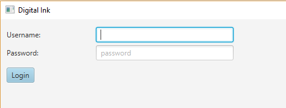

2.  Status label will alert user is username or password is incorrect
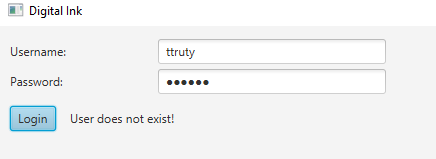
    

### Main View

#### Overview of main screen.

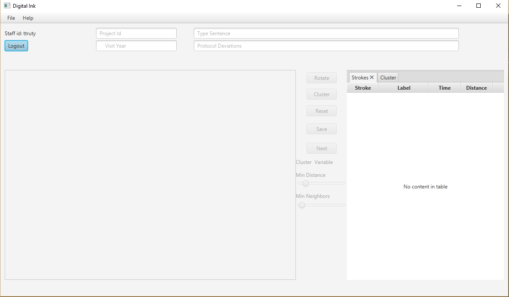

1.  ***Menu Bar for options***.

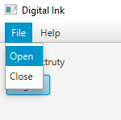

File holds open file select that open file selection dialogue

This only will load files with txt extensions

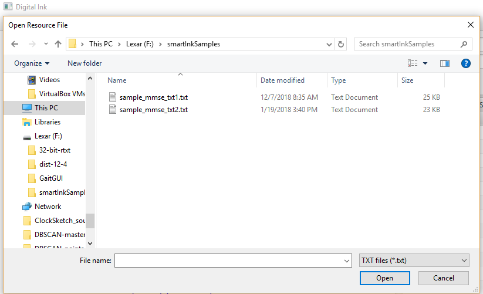

If user loads a file that is a txt but not the correct file an alert
will appear.

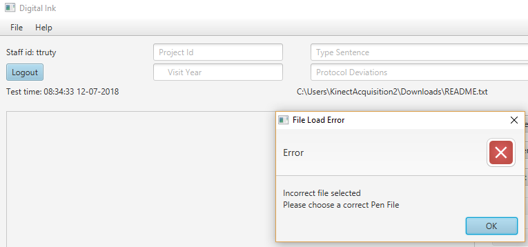

#### Login and file info

Shows the username, file time and file location of loaded file


#### User input for scored file

This takes the user input for the user to type in for the scoring file.

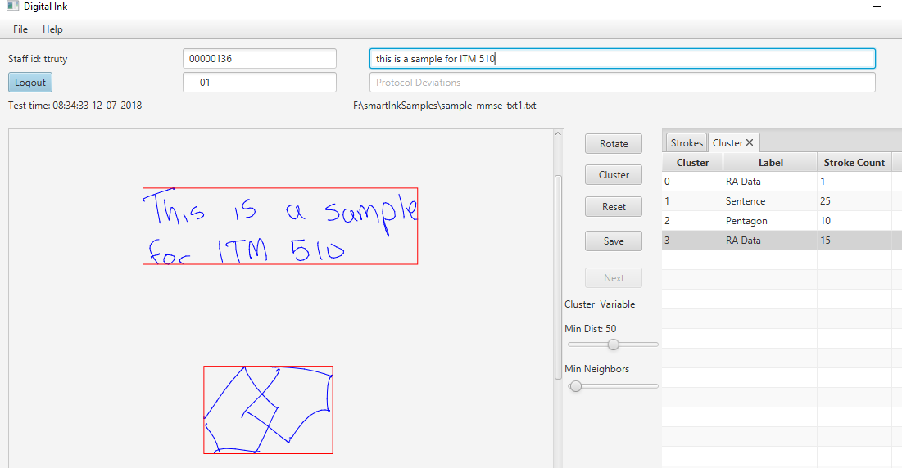

Upon save the input is validated

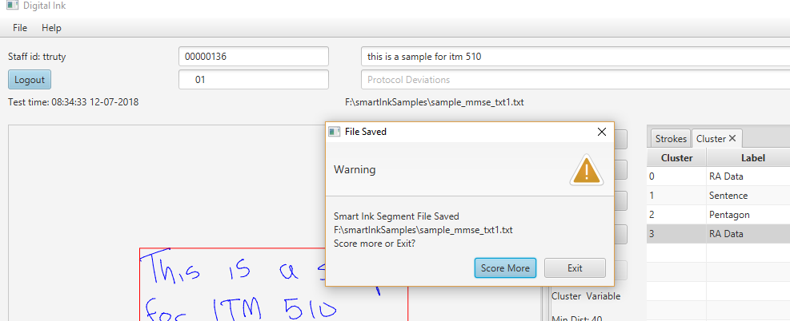

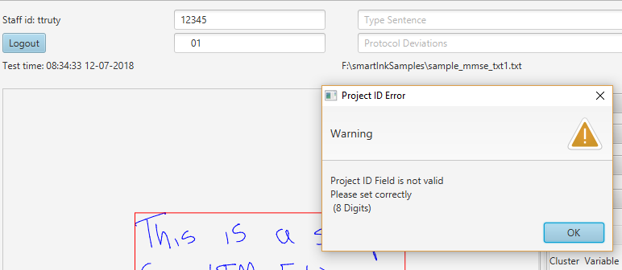

#### View Stroke Graphics

> This pane will show the graphical representation of the stroke data
>
> 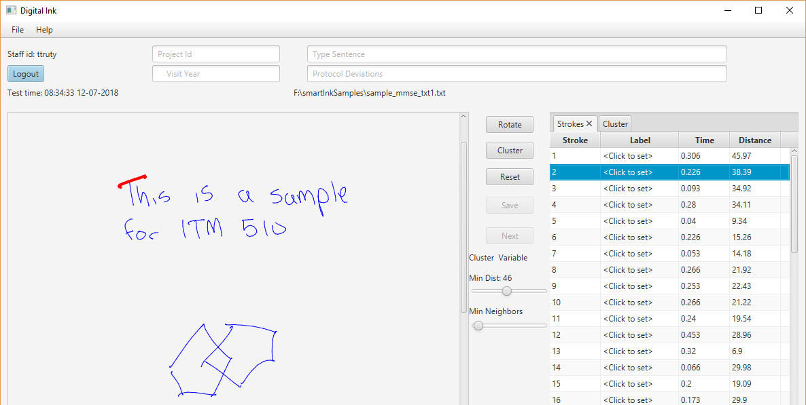

#### User Controls

> Buttons for the user to rotate the drawing, cluster the strokes and
> save. Also hold controls for changing clustering
>
> 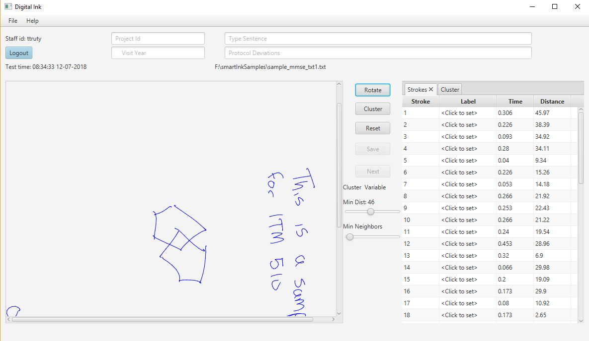

#### Table View

Tab view for viewing the stroke and cluster data, cluster is empty until
the cluster button is pressed

Highlighting individual stroke

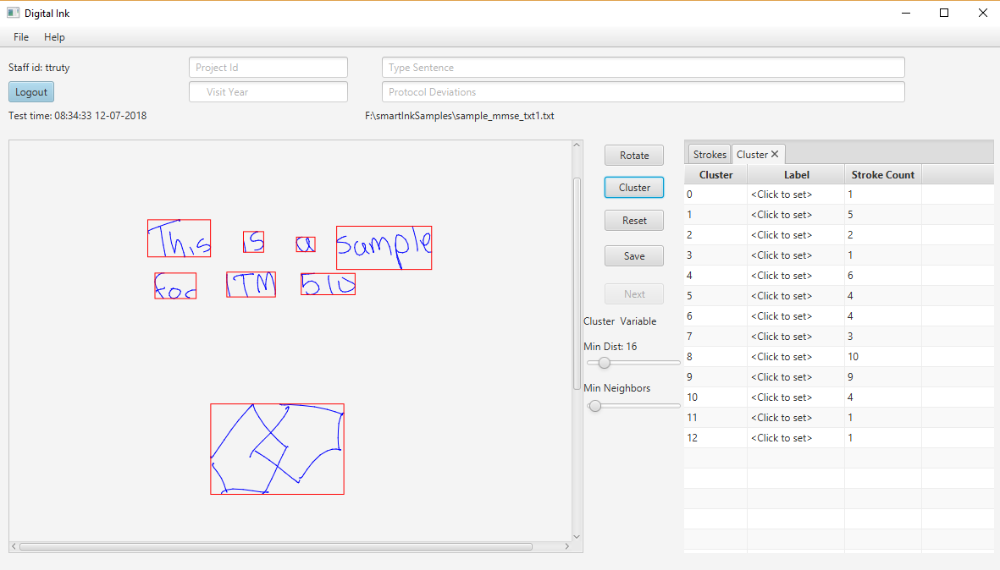

Cluster Button pressed to cluster strokes, the sliders in the control
column can change the clustering. In order to increase the amount of
strokes allowed in each cluster. The goal is to segment each sentence,
pentagon and ra data into as few clusters as possible, but it just makes
the segmentation easier.


This demonstrates the increasing min distance slider and re-clustering.

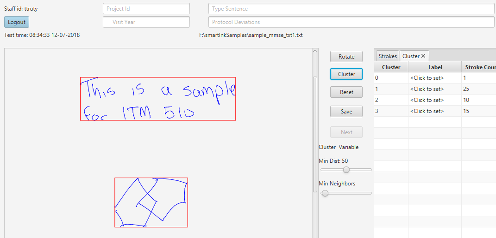

Selection of cluster will highlight all strokes in that cluster

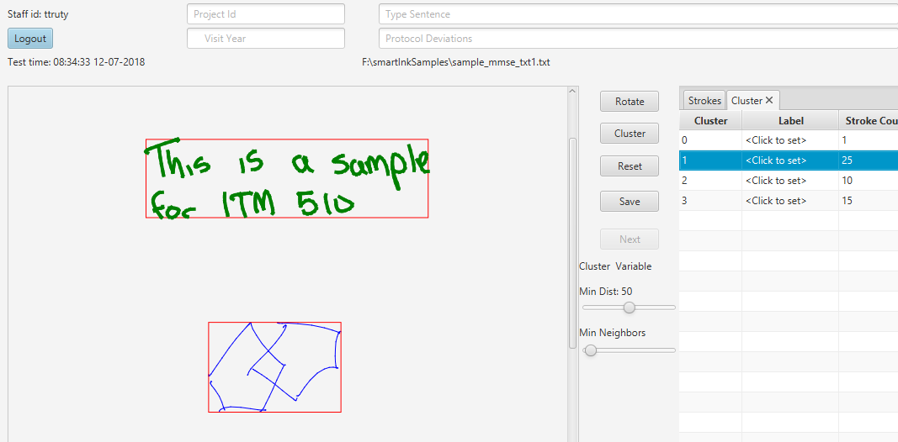

Set the segmentation labels by clicking of the label cell in the cluster
table view

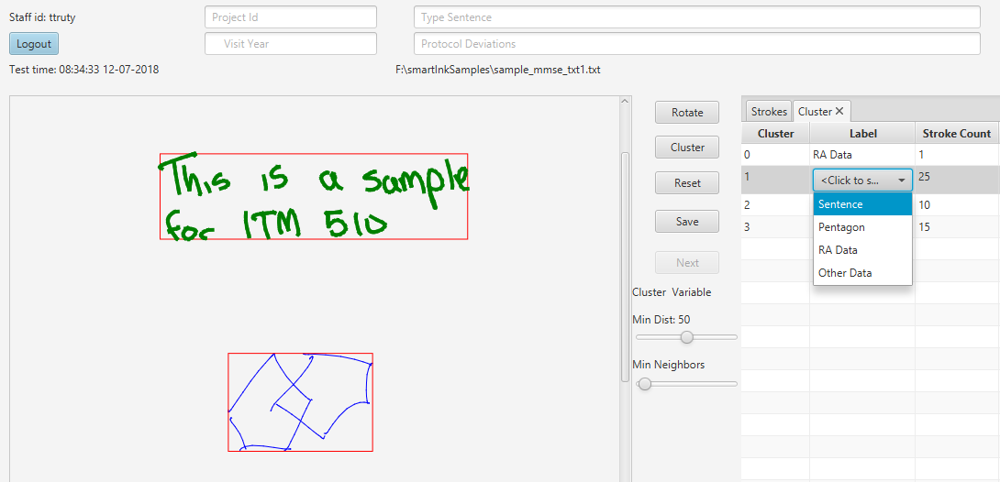

**Once complete press the SAVE BUTTON**

If there is a missing label set the application will alert the use and
not save.


Upon completion the User is alerted and asker to continue scoring or
quit


The output is saved in a csv format. In the save directory as the loaded
txt file and has same base filename with .csv extension.

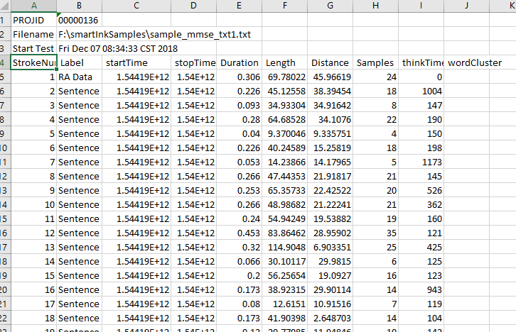
